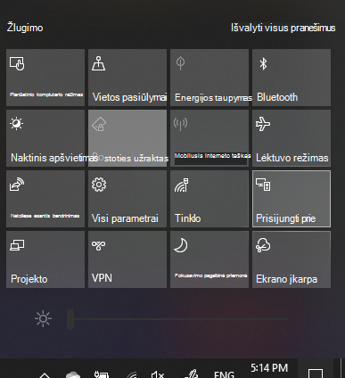

# "Project" su kompiuteriu

Paskirties įrenginyje (projektavimas į) ieškokite "projekcijos parametrai", kad atidarytumėte **šio kompiuterio projektavimo**parametrų puslapį. Tada įsitikinkite, kad:
- "Kai kurie" Windows "ir" Android "įrenginiai gali projektuoti šį kompiuterį, kai sakote, kad" viskas gerai "Išplečiamasis meniu nustatytas kaip **visada išjungtas**.
- Išplečiamasis meniu "klausti į šį kompiuterį" nustatomas **kiekvieną kartą, kai būtinas prisijungimas**.
- Išplečiamajame meniu "reikalauti susiejimo PIN" yra nustatytas kaip **niekada**.

Paskirties įrenginyje paleiskite " **Connect** " taikomąją programą nuėję į **pradžios ekraną** ir ieškokite "Connect".

Tada jūsų šaltinio įrenginyje, kurį bandote projektuoti:

1. Paspauskite **"Windows" klavišą + A** , kad atidarytumėte veiksmų centrą.
2. Spustelėkite **prisijungti**.
3. Spustelėkite įrenginį, į kurį norite projektuoti ekraną.

Po aukščiau aprašytų veiksmų jūsų paskirties įrenginys turėtų Rodyti šaltinio įrenginio ekraną taip, lyg jis būtų antrinis monitorius.
