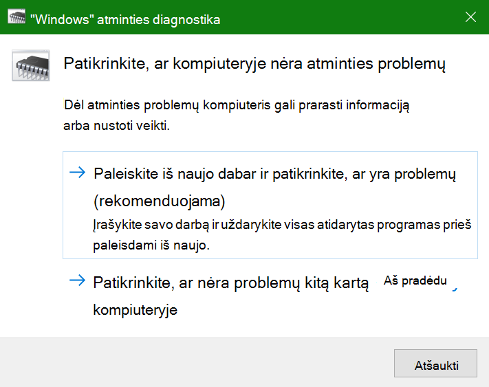

# "Windows" atminties diagnostikos paleidimas sistemoje "Windows 10"Run Windows Memory Diagnostics in Windows 10

Jei "Windows" ir kompiuterio programėlės sugenda, užstringa arba veikia nestabiliai, gali kilti kompiuterio atminties (RAM) problemų.If Windows and apps on your PC are crashing, freezing, or acting in an unstable manner, you may have a problem with the PC’s memory (RAM). Galite paleisti "Windows" atminties diagnostiką, kad patikrinsite kompiuterio RAM problemas.You can run the Windows Memory Diagnostic to check for problems with the PC’s RAM.

Užduočių juostos ieškos lauke įveskite atminties **diagnostika**, tada pasirinkite **"Windows" atminties diagnostika**.In the search box on your taskbar, type **memory diagnostic**, and then select **Windows Memory Diagnostic**. 

Norėdami vykdyti diagnostiką, kompiuteris turi būti paleistas iš naujo.To run the diagnostic, the PC needs to restart. Turite galimybę iš naujo paleisti iš karto (pirmiausia įrašykite savo darbą ir uždarykite atidarytus dokumentus ir el. laiškus) arba suplanuoti diagnostiką, kad ji būtų vykdoma automatiškai, kai kompiuteris bus paleistas iš naujo:You have the option to restart immediately (please save your work and close open documents and e-mails first), or schedule the diagnostic to run automatically the next time the PC restarts:

Kai kompiuteris bus paleistas iš naujo, **"Windows" atminties diagnostikos įrankis** bus paleistas automatiškai.When the PC restarts, the **Windows Memory Diagnostics Tool** will run automatically. Būsena ir eiga bus rodomi kaip diagnostika, o jūs turite galimybę atšaukti diagnostiką paspaudus **klaviatūros klavišą ESC.**Status and progress will be displayed as the diagnostics run, and you have the option of cancelling the diagnostics by hitting the **ESC** key on your keyboard.

Kai diagnostika bus baigta, "Windows" pradės įprastai.When the diagnostics are complete, Windows will start normally.
Iš karto po paleidimo iš naujo, kai rodomas  darbalaukis, bus rodomas pranešimas (užduočių juostoje šalia veiksmų centro piktogramos), nurodantis, ar rasta atminties klaidų.Immediately after restart, when the Desktop appears, a notification will appear (next to the **Action Center** icon on the taskbar), to indicate whether any memory errors were found. Toliau pateikiami pavyzdžiai.For example:

Štai veiksmų centro piktograma:Here's the Action Center icon:  

Ir pranešimo pavyzdys:And a sample notification: 

Jei praleidote pranešimą, užduočių juostoje galite pasirinkti veiksmų centro piktogramą, kad būtų rodomas veiksmų **centras** ir rodomas slenkamas pranešimų sąrašas. If you missed the notification, you can select the **Action Center** icon  on the taskbar to display the **Action Center** and see a scrollable list of notifications.

Norėdami peržiūrėti išsamią informaciją, **įveskite įvykį** užduočių juostos ieškos lauke, tada pasirinkite Įvykių **peržiūros programa**.To review detailed information, type **event** into the search box on your taskbar, and then select **Event Viewer**. Įvykių **peržiūros programos kairiojoje** srityje eikite į **"Windows" žurnalai > Sistema**.In the **Event Viewer**’s left-hand pane, navigate to **Windows Logs > System**. Dešiniosios srities srityje nuskaitykite sąrašą žiūrėdami į stulpelį Šaltinis, kol pamatysite įvykius su šaltinio reikšme **MemoryDiagnostics-Results**. In the right-hand pane, scan down the list while looking at the **Source** column, until you see events with Source value **MemoryDiagnostics-Results**. Pažymėkite kiekvieną tokį įvykį ir peržiūrėkite rezultato informaciją lauke **po skirtuku Bendra** po sąrašu.Highlight each such event and see the result information in the box under the **General** tab below the list.
