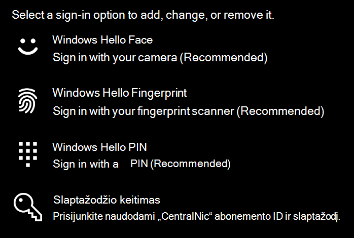

# Pirštų atspaudų atrakinimo parinkties naudojimas "Windows 10"

**"Windows Hello" piršto atspaudo įgalinkite**

Norėdami atrakinti "Windows 10" naudodami piršto atspaudą, turite nustatyti "Windows Hello Fingerprint" įtraukdami (leisdami "Windows" išmokti atpažinti) bent vienu pirštu. 

1. Eikite **į Parametrai > Paskyros > prisijungimo parinktys** (arba spustelėkite [čia](ms-settings:signinoptions?activationSource=GetHelp)). Bus išvardytos galimos prisijungimo parinktys. Toliau pateikiami pavyzdžiai.

    

2. Spustelėkite arba bakstelėkite **"Windows Hello Fingerprint"**, tada **spustelėkite Nustatyti**. Lange "Windows Hello" sąranka spustelėkite **Darbo pradžia**. Pirštų atspaudų jutiklis suaktyvins ir būsite paprašyti pirštu padėti ant jutiklio:

   

3. Vykdykite nurodymus, kuriuose bus nurodyta pakartotinai nuskaityti pirštą. Kai tai bus baigta, galėsite įtraukti kitų pirštų, kuriuos galbūt norėsite naudoti prisijungdami. Kai kitą kartą prisijungsite prie "Windows 10", turėsite galimybę naudoti pirštų atspaudą.

**"Windows Hello Fingerprint" nėra kaip prisijungimo parinktis**

Jei "Windows Hello Fingerprint" nėra rodoma kaip parinktis prisijungimo parinktyse, tai reiškia, kad "Windows" nežino apie pirštų atspaudų skaitytuvą / skaitytuvą, pridėtą prie jūsų kompiuterio, arba kad sistemos strategija neleidžia jo naudoti (pvz., jei jūsų kompiuterį valdo jūsų darbovietė). Norėdami šalinti triktis: 

1. Užduočių **juostoje pasirinkite** mygtuką Pradžia ir ieškokite Įrenginių **tvarkytuvė.**

2. Spustelėkite arba bakstelėkite, kad atidarytumėte **įrenginių tvarkytuvę.**

3. Įrenginių tvarkytuvėje išplėskite Biometriniai įrenginiai spustelėdami savo "v" pavidalo.

   

4. Jūsų pirštų atspaudų skaitytuvas turi būti nurodytas kaip biometrinis įrenginys, pvz., "Synaptics WBDI" skaitytuvas:

   

5. Jei pirštų atspaudų skaitytuvas nerodomas ir skaitytuvas integruotas į jūsų kompiuterį, eikite į kompiuterio gamintojo svetainę. Kompiuterio modelio techninio palaikymo skyriuje ieškokite skaitytuvo, kurį galite įdiegti, "Windows 10" tvarkyklės.

6. Jei skaitytuvas yra atskirtas nuo kompiuterio (pridėto per USB), eikite į skaitytuvo gamintojo svetainę, kad rastumėte ir įdiegtumėte "Windows 10" įrenginio tvarkyklės programinę įrangą, skirtą jūsų turimo skaitytuvo modeliui.
